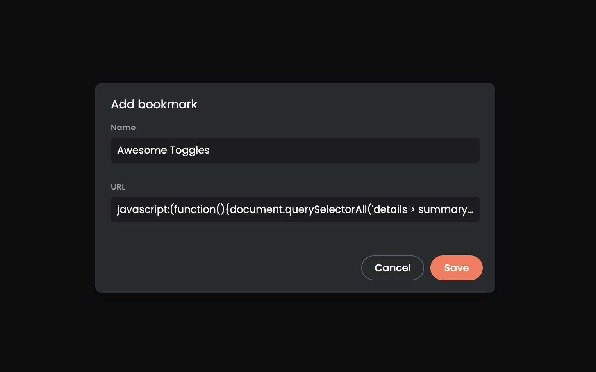

## Expand All Toggles!

Want to view everything at once? 
Follow these easy steps to create a bookmark that runs JS code to search for toggles in the DOM and change their state.



> Set it up once, use it anytime!

1. Open your browser’s bookmark manager. This is usually found in the bookmarks menu.
2. Right-click in the bookmark manager and select ‘Add new bookmark’ or ‘Create new bookmark’.
3. A dialog box should appear. Enter anything in the name field, example 'Awesome Toggles'.
4. Paste this safe JS code into the URL field.
    ```javascript
    javascript:(function(){document.querySelectorAll('details > summary > strong').forEach(strong => { if (strong.textContent.trim().length > 0) { strong.closest('details').open = true; }});})();
    ```
5. Save the new bookmark. That's it!

Now, whenever you're viewing the README.md of [Awesome Topics](https://github.com/Mahmoudz/awesome-topics), simply click this bookmark to unveil all toggle content at once. 😉